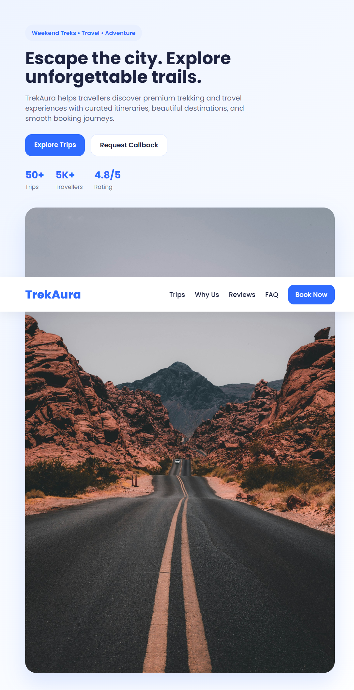
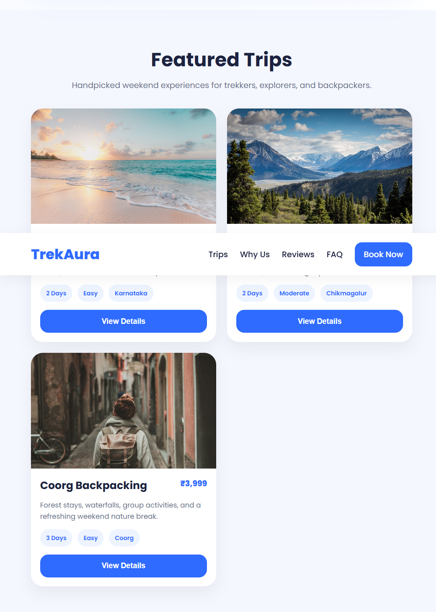
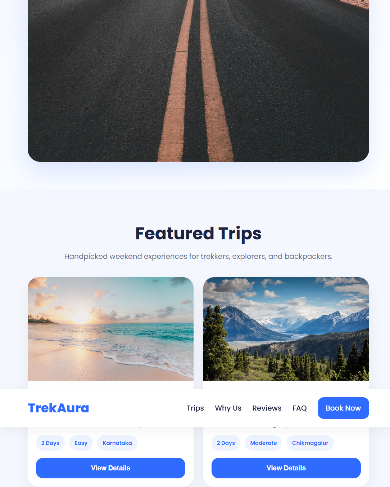
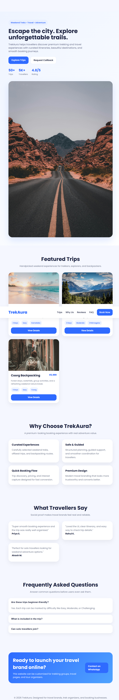

# TrekAura Travel Website

A premium travel and trek booking website designed for trekking groups, tour organizers, and travel brands.

## Features

- Modern hero section with CTA buttons
- Featured trips with pricing and highlights
- Why Choose Us section
- Testimonials section
- FAQ accordion
- WhatsApp contact button
- Responsive design for desktop and mobile

## Tech Stack

- HTML
- CSS
- JavaScript

## Screenshots

### Hero Section

### Featured Trips

### FAQ Section

### Mobile View

## Use Case

This website is suitable for:
- trekking groups
- travel startups
- tour organizers
- backpacking communities
- adventure brands

## Freelance Availability

Available for travel website design, landing pages, booking-style websites, and custom business websites.

## Author

Nethra Nekar